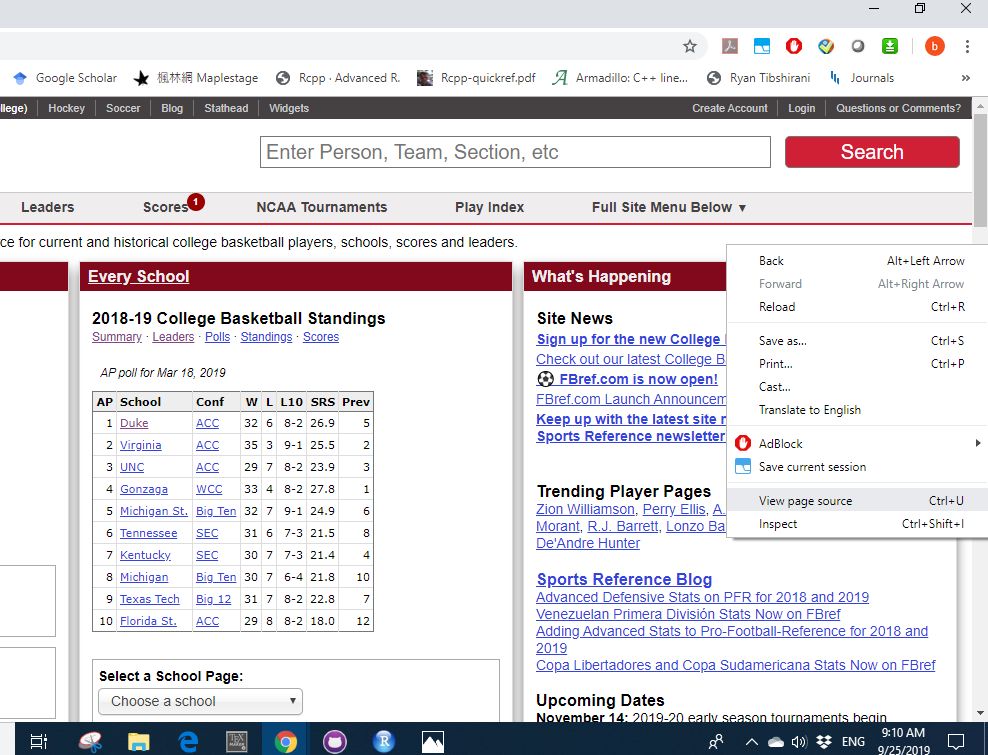

```{r setup, include=FALSE}
knitr::opts_chunk$set(echo = FALSE)
```

## Outline

- Why do we need to "scrap"?

- Types of web scraping

- Using R
  + Single page
  + dynamic pages

- Case study (college basketball)

- Summary


## Motivation
Have you experienced ...

- Have a topic in mind, but not sure Where to find the data. 

- Found related data online, not able to download directly.

- Need a reproducible way to capture similar data repeatedly.

- Need more than just numbers, maybe also texts, images, or even Gifs.


## Different types of web scraping
[Example (College basketball)](https://www.sports-reference.com/cbb/schools/)

- Human Copy-Paste: Click, drag, ctrl+c, ctrl+v. Slow and inefficient.

- Text pattern matching: make use of [regular expression](https://regexr.com/). Complicated, need specific software to implement. 

- API interface: [ScraperAPI](https://www.scraperapi.com/?fp_ref=krishna-32), [Octoparse](https://www.octoparse.com/?AgentCode=296), powerful but expensive, some pages may not be accessible.  

- DOM (Document Object Model) parsing: Treat each webpage as a tree structure wherein each node is an object representing a part of the document. Not intuitive, require programming language.

## Getting started

- Prerequisites: R and RStudio preinstalled.

- Advantages of R: 

      - open source, it's FREE!
      
      - lightweight (compared with commerical software such as MATLAB, SAS) 
      
      - awesome package ecosystem ($> 12,000$ packages available on CRAN now)

- Use `help()` function to take a closer look.

```{r help, echo=TRUE, eval=FALSE}
?help                         # details on using the `help` function
help(package = "deuce")       # information about the stats package
```

## Getting started (need revision)

- For this workshop, we'll utilize a few packages in R:

```{r pckgs, eval=FALSE, echo=TRUE}
install.packages("rvest",repos = "http://cran.us.r-project.org")
install.packages("RSelenium",repos = "http://cran.us.r-project.org")
library(devtools)
install_github("skoval/deuce")
```


## Getting started

Before we jump into syntax, let's take a look at the source we want to scrape. 

- Some data files are available already? Import directly! 

- The web pages are simple ...
    
    + data is hidden in the source code (static data)

- The web pages are complicated ...

    + the numbers are not in the source code (dynamic data)


## Importing files stored online
- Files that can be read with `read.csv` or related functions can be directly imported from a URL.

- Example: we extract the most recent Australian Open match results:
```{r echo=TRUE, message=FALSE, warning=FALSE}
url <- "http://www.tennis-data.co.uk/2019/ausopen.csv"
tennis_aus <- read.csv(url)
print(dim(tennis_aus))
tennis_aus[1,1:6]
```

## Importing files stored online

- We can use `download.file()` to download the file to your working directory and then work with this data as desired.
```{r eval=FALSE, echo=TRUE}
url <- "http://www.bls.gov/cex/pumd/data/comma/diary14.zip"

# download .zip file and unzip contents
download.file(url, dest = "dataset.zip", mode = "wb") 
unzip("dataset.zip")

# assess the files contained in the .zip file which
# unzips as a folder named "diary14"
list.files("diary14")
```

- Not neccessarily to save the zip file, [`tempfile()`](https://stackoverflow.com/questions/3053833/using-r-to-download-zipped-data-file-extract-and-import-data)


## Exercise: online file import

If we wanted the same data for the 2018 US Open, how do you think we could do that?

1. Test a possible URL for the 2018 US Open

2. Import the file

## Solution: online file import

Changing the year and tournament names in the URL are enough to get the correct file.

```{r echo=TRUE, message=FALSE, warning=FALSE}
url <- "http://www.tennis-data.co.uk/2018/usopen.csv"
tennis_us <- read.csv(url)
```

What about the format?
```{r echo=TRUE, message=FALSE, warning=FALSE}
print(dim(tennis_us))
tennis_us[1,1:6]
```


## Static \& dynamic data

Unfortunately, most of the data are not available directly. 

In this case, you can still capture the data but you need to know whether it is `static` or `dynamic` data. Web developer tools open the door to "view source". 

```{r, out.width = "400px"}
knitr::include_graphics("slides_files/web_dev_mac.png")

```

## Exercise: static or dynamic? 

- [Apple](https://www.apple.com/iphone-11/specs/)

- [Quora](https://www.quora.com/)

- [Tennis Elo rankings](http://tennisabstract.com/reports/atp_elo_ratings.html)

- [Sports reference](https://www.sports-reference.com/cbb/players/chris-clemons-2.html)


## Scrap static data

- HTML elements are written with a start tag, an end tag, and with the content in between: `<tagname>content<tagname>`. The tags which typically contain the textual content we wish to scrape, and the tags we will leverage in the next two sections, include:

    + `<h1>`, `<h2>`: headings; `<p>`: Paragraph; 
      `<div>`: Division or section; `<table>`: Table


- `readLines()`. Restricted usage, need further cleaning.
```{r echo=TRUE, message=FALSE, warning=FALSE}
tennis_elo <- readLines("http://tennisabstract.com/reports/atp_elo_ratings.html")
tennis_elo[1:3]
```

## Scrap static data

- With scraping packages like `rvest` or `RCurl`. 

- `rvest`: Instead of going line by line, we search for specific tagnames(nodes). 
    
    + Developed by RStudio team, make use of the pipe operator [%>%](http://uc-r.github.io/pipe) developed through the `magrittr` package.
    
    + data %>% filter(variable == numeric_value)

```{r echo=TRUE, message=FALSE, warning=FALSE}
require('rvest')
url <- 'https://www.sports-reference.com/cbb/players/chris-clemons-2.html'
webpage <- read_html(url)
```    

## Scrap static data
```{r echo=TRUE, message=FALSE, warning=FALSE}
data <- webpage %>%
        html_nodes(css = 'table') %>%
        html_table()
cat("Extracted", length(data), "tables, with", nrow(data[[1]]), "rows and", ncol(data[[1]]), "columns \n")
head(data[[1]][1,1:8])
```    

- Why do we only the first table? 

## Exercise: static data
- Try to scrap the box scores for NBA games in [June 13th](https://www.basketball-reference.com/boxscores/?month=6&day=13&year=2019). 
    
    + how to verify the date?

    + how many tables do you think there are?
    
    + what if we are only interested in a specific one? (eg. East division)
    
    + how to calculate the average win/loss percentenge in Atlantic division? 
    
## Solution: static data
```{r echo=TRUE, message=FALSE, warning=FALSE}
require('rvest')
webpage <- read_html('https://www.basketball-reference.com/boxscores/?month=6&day=13&year=2019')
date <- webpage %>% html_nodes(css = 'h1') %>% html_text()
date[[1]]
```

```{r echo=TRUE, message=FALSE, warning=FALSE}
boxscore_0613 <- webpage %>%
                html_nodes(css = 'table') %>%
                html_table()
length(boxscore_0613)
```    
 
## Solution: static data
```{r echo=TRUE, message=FALSE, warning=FALSE}
boxscore_east <- webpage %>%
                html_nodes(xpath = '//*[@id="divs_standings_E"]') %>%
                html_table(header = T)
boxscore_east[[1]][1:3,1:3]
```       
```{r echo=TRUE, message=FALSE, warning=FALSE}
boxscore_east <- boxscore_east[[1]]
mean(as.numeric(boxscore_east$`W/L%`[2:6]))
``` 

## Scrap dynamic data

- Because dynamic data is created on-the-fly (in response to user interactions) we have to browse to get access to it 

- Fortunately, we can automate browsing 

- We just need to find what instructions to give to mimic the browsing, and get familiar with tools that can implement these instructions

## Scrap dynamic data

- With packages `RSelenium`. [Selenium](https://www.seleniumhq.org/) is a software that allows automated Web browsing. 

```{r echo=TRUE, eval=FALSE}
install.packages("RSelenium",repos = "http://cran.us.r-project.org")
require(RSelenium)
```    

- Lots of functions are implemented and [documented](https://cran.r-project.org/web/packages/RSelenium/RSelenium.pdf), basic steps including:

    +Set the Web driver (select browser and port)
    
    +Find the elements with the data
    
    +Extract the content
    
    +Parse the contents

## Example: dynamic data

## Exercise: dynamic data

## Solution: dynamic data

## Case study: 

## Resources

- [CSS and HTML crash course](http://flukeout.github.io/)

- [rvest](https://www.r-bloggers.com/rvest-easy-web-scraping-with-r/)

- [RSelenium](https://ropensci.org/tutorials/rselenium_tutorial.html)

- [R task: web technology](https://cran.r-project.org/web/views/WebTechnologies.html)


