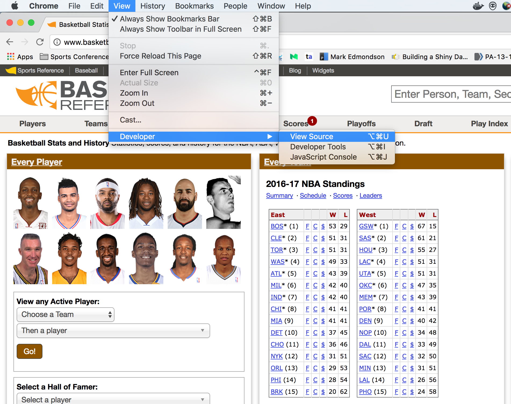
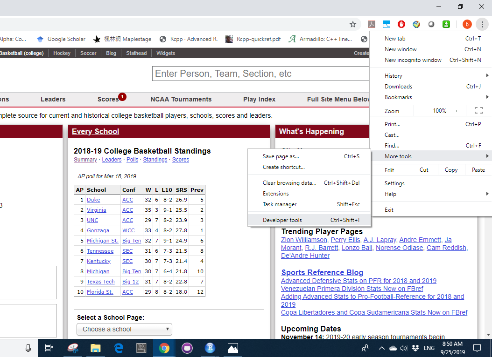

```{r setup, include=FALSE}
knitr::opts_chunk$set(echo = FALSE)
```

## Outline

- Why do we need to "scrap"?

- Types of web scraping

- Using R
  + static data
  + dynamic data

- Case study (college basketball - UConn)

- Summary


## Motivation
Have you experienced ...

- Have a topic in mind, but not sure Where to find the data. 

- Found related data online, not able to download directly.

- Need a reproducible way to capture similar data repeatedly.

- Need more than just numbers, maybe also texts, images, or even Gifs.


## Different types of web scraping
[Example (College basketball)](https://www.sports-reference.com/cbb/schools/)

- Human Copy-Paste: Click, drag, ctrl+c, ctrl+v. Slow and inefficient.

- Text pattern matching: make use of [regular expression](https://regexr.com/). Complicated, need specific software to implement. 

- API interface: [ScraperAPI](https://www.scraperapi.com/?fp_ref=krishna-32), [Octoparse](https://www.octoparse.com/?AgentCode=296), powerful but expensive, some pages may not be accessible.  

- DOM (Document Object Model) parsing: Treat each webpage as a tree structure wherein each node is an object representing a part of the document. Not intuitive, require programming language.

## Getting started

- Prerequisites: R and RStudio preinstalled.

- Advantages of R: 

      - open source, it's FREE!
      
      - lightweight (compared with commerical software such as MATLAB, SAS) 
      
      - awesome package ecosystem (more than 12,000 packages available on CRAN now)

- Use `help()` function to take a closer look.

```{r help, echo=TRUE, eval=FALSE}
?help                         # details on using the `help` function
help(package = "stats")       # information about the stats package
```

## Getting started 

- For this workshop, we'll utilize a few packages in R:

```{r pckgs, eval=FALSE, echo=TRUE}
install.packages("rvest",repos = "http://cran.us.r-project.org")
install.packages("RSelenium",repos = "http://cran.us.r-project.org")
library(devtools)
install_github("skoval/deuce")
```


## Getting started

Before we jump into syntax, let's take a look at the source we want to scrape. 

- Some data files are available already? Import directly! 

- The web pages are simple ...
    
    + data is hidden in the source code (static data)

- The web pages are complicated ...

    + the numbers are not in the source code (dynamic data)


## Importing files stored online
- Files that can be read with `read.csv` or related functions can be directly imported from a URL.

- Example: we extract the most recent Australian Open match results:
```{r echo=TRUE, message=FALSE, warning=FALSE}
url <- "http://www.tennis-data.co.uk/2019/ausopen.csv"
tennis_aus <- read.csv(url)
print(dim(tennis_aus))
tennis_aus[1,1:6]
```

## Importing files stored online

- We can use `download.file()` to download the file to your working directory and then work with this data as desired.
```{r eval=FALSE, echo=TRUE}
url <- "http://www.bls.gov/cex/pumd/data/comma/diary14.zip"

# download .zip file and unzip contents
download.file(url, dest = "dataset.zip", mode = "wb") 
unzip("dataset.zip")

# assess the files contained in the .zip file which
# unzips as a folder named "diary14"
list.files("diary14")
```

- Not neccessarily to save the zip file, [`tempfile()`](https://stackoverflow.com/questions/3053833/using-r-to-download-zipped-data-file-extract-and-import-data)


## Exercise: online file import

If we wanted the same data for the 2018 US Open, how do you think we could do that?

1. Test a possible URL for the 2018 US Open

2. Import the file

## Solution: online file import

Changing the year and tournament names in the URL are enough to get the correct file.

```{r echo=TRUE, message=FALSE, warning=FALSE}
url <- "http://www.tennis-data.co.uk/2018/usopen.csv"
tennis_us <- read.csv(url)
```

What about the format?
```{r echo=TRUE, message=FALSE, warning=FALSE}
print(dim(tennis_us))
tennis_us[1,1:6]
```


## Static \& dynamic data

Unfortunately, most of the data are not available directly. 

In this case, you can still capture the data but you need to know whether it is `static` or `dynamic` data. Web developer tools open the door to "view source". 

```{r, out.width = "400px"}


```

## Exercise: static or dynamic? 

- [Apple](https://www.apple.com/iphone-11/specs/)

- [Quora](https://www.quora.com/)

- [Tennis Elo rankings](http://tennisabstract.com/reports/atp_elo_ratings.html)

- [Sports reference](https://www.sports-reference.com/cbb/players/chris-clemons-2.html)


## Scrap static data

- HTML elements are written with a start tag, an end tag, and with the content in between: `<tagname>content<tagname>`. The tags which typically contain the textual content we wish to scrape, and the tags we will leverage in the next two sections, include:

    + `<h1>`, `<h2>`: headings; `<p>`: Paragraph; 
      `<div>`: Division or section; `<table>`: Table


- `readLines()`. Restricted usage, need further cleaning.
```{r echo=TRUE, message=FALSE, warning=FALSE}
tennis_elo <- readLines("http://tennisabstract.com/reports/atp_elo_ratings.html")
tennis_elo[1:3]
```

## Scrap static data

- With scraping packages like `rvest` or `RCurl`. 

- `rvest`: Instead of going line by line, we search for specific tagnames(nodes). 
    
    + Developed by RStudio team, make use of the pipe operator [%>%](http://uc-r.github.io/pipe) developed through the `magrittr` package.
    
    + data %>% filter(variable == numeric_value)

```{r echo=TRUE, message=FALSE, warning=FALSE}
require('rvest')
url <- 'https://www.sports-reference.com/cbb/players/chris-clemons-2.html'
webpage <- read_html(url)
```    

## Scrap static data
```{r echo=TRUE, message=FALSE, warning=FALSE}
data <- webpage %>%
        html_nodes(css = 'table') %>%
        html_table()
cat("Extracted", length(data), "tables, with", nrow(data[[1]]), "rows and", ncol(data[[1]]), "columns \n")
head(data[[1]][1,1:8])
```    

- Why do we only the first table? 

## Exercise: static data
- Try to scrap the box scores for NBA games in [June 13th](https://www.basketball-reference.com/boxscores/?month=6&day=13&year=2019). 
    
    + how to verify the date?

    + how many tables do you think there are?
    
    + what if we are only interested in a specific one? (eg. East division)
    
    + how to calculate the average win/loss percentenge in Atlantic division? 
    
## Solution: static data
```{r echo=TRUE, message=FALSE, warning=FALSE}
require('rvest')
webpage <- read_html('https://www.basketball-reference.com/boxscores/?month=6&day=13&year=2019')
date <- webpage %>% html_nodes(css = 'h1') %>% html_text()
date[[1]]
```

```{r echo=TRUE, message=FALSE, warning=FALSE}
boxscore_0613 <- webpage %>%
                html_nodes(css = 'table') %>%
                html_table()
length(boxscore_0613)
```    
 
## Solution: static data
```{r echo=TRUE, message=FALSE, warning=FALSE}
boxscore_east <- webpage %>%
                html_nodes(xpath = '//*[@id="divs_standings_E"]') %>%
                html_table(header = T)
boxscore_east[[1]][1:3,1:3]
```       

```{r echo=TRUE, message=FALSE, warning=FALSE}
boxscore_east <- boxscore_east[[1]]
mean(as.numeric(boxscore_east$`W/L%`[2:6]))
``` 

## Exercise: loop through static data 
- How to extract all Toronto Raptor's score in every month's first day in 2018?

    - start with [January 1st](https://www.basketball-reference.com/boxscores/?month=1&day=1&year=2018)
    
    - pattern in the url
    
    - implement R loop

- Can you extend this to the whole year 2018? 


## Solution: loop through static data 

```{r eval=FALSE, echo=TRUE, message=FALSE, warning=FALSE}
require('rvest')
url_common_start <- "https://www.basketball-reference.com/boxscores/?month="
url_common_end <- "&day=1&year=2018"

score_raptor_2018 <- NULL
for (month in c(1:6,11,12)){
  url <- paste0(url_common_start,month,url_common_end)
  webpage <- read_html(url)
  boxscore <- webpage %>%
    html_nodes(xpath = '//*[@id="divs_standings_E"]') %>%
    html_table(header=T)
  boxscore <- boxscore[[1]]
  score_raptor_month <- boxscore[boxscore$`Eastern Conference` == "Toronto Raptors*",]
  score_raptor_2018 <- rbind(score_raptor_2018,score_raptor_month,make.row.names = FALSE)
}
score_raptor_2018["Month"] <- c(1:6,11,12)
head(score_raptor_2018)
``` 


## Scrap dynamic data

- Because dynamic data is created on-the-fly (in response to user interactions) we have to browse to get access to it. 

- How do we "browse"? open Chrome, read content, find the keywords, extract information.

- Can this process be automated?

- YES! We just need to find what instructions to give to mimic the browsing, and get familiar with tools that can implement these instructions.

## Set up `RSelenium`

- With packages `RSelenium`, an interface with software [Selenium](https://www.seleniumhq.org/), makes it easy to connect to a Selenium Server.

```{r eval=FALSE, message=FALSE, warning=FALSE, echo = TRUE}
install.packages("RSelenium",repos = "http://cran.us.r-project.org")
require(RSelenium)
```

- Connect to a server. Other methods include using [Docker](https://cran.r-project.org/web/packages/RSelenium/vignettes/basics.html#introduction) or [Java binary](https://cran.r-project.org/web/packages/RSelenium/vignettes/basics.html#introduction).
```{r eval=FALSE, message=FALSE, warning=FALSE, echo = TRUE}
## try default function
rD <- rsDriver(port = 4444L, browser = "chrome")
```    


## Set up `RSelenium`
Possible errors:


- check the version of your chrome driver (chromehelp -> about google chrome -> version), check the supported selenium driver, find the closet configuration in the package, change default value.

```{r echo=TRUE, message=FALSE, warning=FALSE}
binman::list_versions("chromedriver")
```

```{r eval=FALSE, message=FALSE, warning=FALSE, echo = TRUE}
rD <- rsDriver(port = 4444L, browser = "chrome",chromever = "77.0.3865.40")
```

## Set up `RSelenium`
Possible error:


- Try a different number as port, any positive number should work.
```{r eval=FALSE, message=FALSE, warning=FALSE, echo = TRUE}
rD <- rsDriver(port = 5678L, browser = "chrome",chromever = "77.0.3865.40")
```

After this command, you should see a pop-up blank tab, let's move on!

## Scrap dynamic data
- Lots of functions are implemented and [documented](https://cran.r-project.org/web/packages/RSelenium/RSelenium.pdf), basic steps including:

    - Set the Web driver, select browser and port (hopefully done!)
    
    - Find the elements with the data
    
    - Extract the content
    
    - Parse the contents
    

## Example: dynamic data
Consider the following match summary: [2017 Australian Open Final](http://www.flashscore.com/match/Cj6I5iL9/#match-statistics;0)

<center>
{width=70%}
</center>


## Example: dynamic data

If we inspect the page, we find that these stats are dynamic data. We also find that the main table of content has the id `detail`.

<center>
{width=95%}
</center>


## Example: dynamic data
Following previous steps, after setting up the server, we extract the table of stats using the CSS `id` node.

```{r eval=FALSE, message=FALSE, warning=FALSE, echo = TRUE}
# Get id element
webElem <- remDr$findElements(using = 'id', "detail")
#  Use getElementText to extract the text from this element
unlist(lapply(webElem, function(x){x$getElementText()}))[[1]]
remDr$close() # Close driver when finished
```

## Exercise: dynamic data
Take a look at another match [summary](https://www.flashscore.com/match/fNecEwW2/#match-statistics;0), can you extract the statistics in set 1, 2 and 3 seperately and compare to the full match result? 

- Set up driver for this url;

- Find the key word you want to extract;

- Write a loop based on our example;

- Organize the result 

    - Hint: for a long string, `gsub()` and `strsplit()` can be useful.
    
## Solution: dynamic data
```{r eval=FALSE, message=FALSE, warning=FALSE, echo = TRUE}
# set up server
remDr <- rsDriver(port = 5558L, browser = "chrome",version = "4.0.0-alpha-2",
               chromever = "77.0.3865.40")
remDr <- remDr[["client"]]
# start loop
url <- "https://www.flashscore.com/match/fNecEwW2/#match-statistics;"
result <- NULL
# start loop
for (i in 0:3){
  # navigate page
  remDr$navigate(paste0(url,i)) 
  # find elements
  webElem <- remDr$findElements(using = 'id', "detail")
  #  Use getElementText to extract the text from this element
  result[i+1] <- unlist(lapply(webElem, function(x){x$getElementText()}))[[1]]
}
# close server
remDr$close() # Close driver when finished
```

## Solution: dynamic data
```{r eval=FALSE, message=FALSE, warning=FALSE, echo = TRUE}
result_set <- NULL
for (i in 1:4){
  res <- result[i]
  # keep only useful information
  res <- gsub(".*Set 3\n(.+)  close window.*", "\\1", res)
  # split string into vector
  result_set <- cbind(result_set,unlist(strsplit(res, split = '\n')))
}
colnames(result_set) <- c("match","set1", "set2","set3")
head(result_set)
```


## What else ...

There are some other functions in the `RSelenium` package, including but not limited to:

- `findElement()` with CSS selector or Xpath

- `sendKeysToElement()`, you can type in the query box (like Google), or press enter key using this command.

- `clickElement()`, mimic mouse event

- `getTitle()`,`getSource()`,`screenshot()`,`switchToFrame()`...

- [R openSCI document]("https://ropensci.github.io/RSelenium/articles/basics.html") provides a detailed example on Google homepage.


## Case study: College basketball - UConn
If we want to know how is UConn's performance at NCAA basketball 2018/2019, which kind of data may be helpful? 

- match record, Win/loss

- score record, home/away

- component information, head to head statistics

There are tons of websites/resources out there, I'll use [FlashScore](https://www.flashscore.com/) as an example today. 


## Case study: College basketball - UConn
Let's take a look at UConn's [homepage](https://www.flashscore.com/team/connecticut-huskies/8rqVf3Tj/results/):

<center>
{width=75%}
</center>

## Case study: College basketball - UConn
```{r eval=FALSE, message=FALSE, warning=FALSE, echo = TRUE}
url <- "https://www.flashscore.com/team/connecticut-huskies/8rqVf3Tj/results/"
remDr <- rsDriver(port = 5556L, browser = "chrome",version = "4.0.0-alpha-2",
               chromever = "77.0.3865.40")
remDr <- remDr[["client"]]
```

<center>
{width=80%}
</center>

## Case study: College basketball - UConn
```{r eval=FALSE, message=FALSE, warning=FALSE, echo = TRUE}
webElem <- remDr$findElements(using = 'id', "live-table")
unlist(lapply(webElem, function(x){x$getElementText()}))
```

<center>
{width=60%}
</center>

<center>

</center>

- It would be great to collect more information, i.e., click the show more matches. 

## Case study: College basketball - UConn
- To "click", we inspect the element (right click -> inspect -> right click highlight -> copy -> copy selector), then apply `findElements()`. 

- Just like when we click with mouse, there is no guarantee how many more rows we get to see. A while loop would be useful now. 
```{r eval=FALSE, message=FALSE, warning=FALSE, echo = TRUE}
remDr$navigate(url)
repeat{
  x <- try(click_ind <- remDr$findElement(using = 'css selector', 
                                          "#live-table > div > div > div > a"),
      silent=TRUE)
  if (inherits(x, "try-error")) break
  click_ind$clickElement()
}
webElem <- remDr$findElements(using = 'id', "live-table")
uconn_score_all <- unlist(lapply(webElem, function(x){x$getElementText()}))
```

## Case study: College basketball - UConn
- Now with all the available data, time to scrap and clean! 

```{r eval=FALSE, message=FALSE, warning=FALSE, echo = TRUE}
uconn_score <- unlist(strsplit(uconn_score_all, split = '\n'))[-c(1:3)]
uconn_score[1:50]
```
<center>

</center>


## Case study: College basketball - UConn
What about a match predictions? 

- Just for a minute, pretend we are at March 13th, 2019. There will be a game between South Florida and UConn tomorrow. 

- To predict which one would win, we may need...

    + Head to head statistics between the two teams
    
    + SFU winning rate, UConn winning rate etc.


## Case study: College basketball - UConn
For head to head comparison, inspect the element first again:
<center>
{width=60%}
</center>

## Case study: College basketball - UConn

```{r eval=FALSE, message=FALSE, warning=FALSE, echo = TRUE}
url <- "https://www.flashscore.com/match/IRo6KWr7/#h2h;overall"
remDr$navigate(url)
webElem <- remDr$findElement(using = 'css selector', 
                             "#tab-h2h-overall > div:nth-child(3) > 
                             table > tbody > tr.hid > td > a")
webElem$clickElement()
```

## Case study: College basketball - UConn
```{r eval=FALSE, message=FALSE, warning=FALSE, echo = TRUE}
webElem <- remDr$findElement(using = 'css selector', 
                             "#tab-h2h-overall > div:nth-child(3) > table")
h2h <- unlist(webElem$getElementText())
h2h <- unlist(strsplit(h2h, split = '\n'))[-c(1,17,20)]
h2h <- gsub("South Florida", "SF", h2h)
win_team <- NULL
for (i in 1:length(h2h)){
  team <- h2h[[i]][c(3,4)]
  score <- as.numeric(h2h[[i]][c(5,7)])
  win_team <- c(win_team,team[which.max(score)])
}
```


## Case study: College basketball - UConn
- Looks like UConn is gonna win! 

<center>

</center>

## Resources

- [CSS and HTML crash course](http://flukeout.github.io/)

- [rvest](https://www.r-bloggers.com/rvest-easy-web-scraping-with-r/)

- [RSelenium](https://ropensci.org/tutorials/rselenium_tutorial.html)

- [R task: web technology](https://cran.r-project.org/web/views/WebTechnologies.html)


