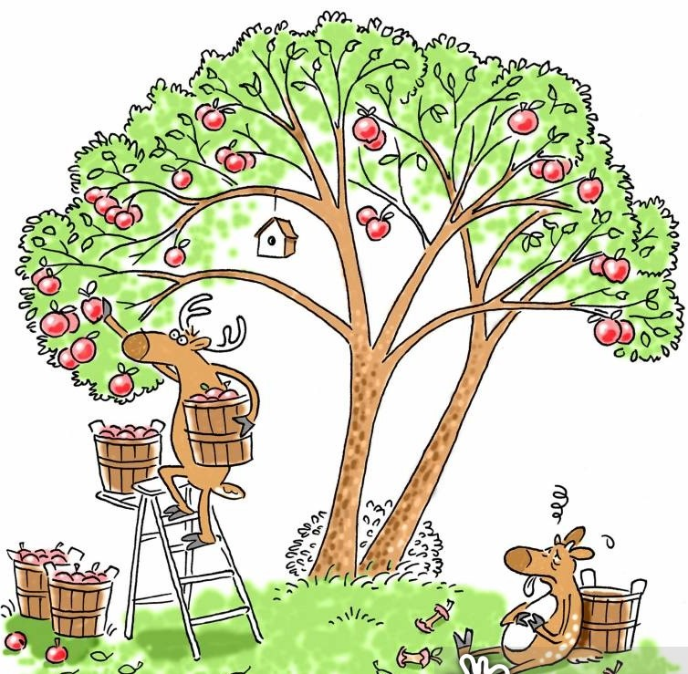
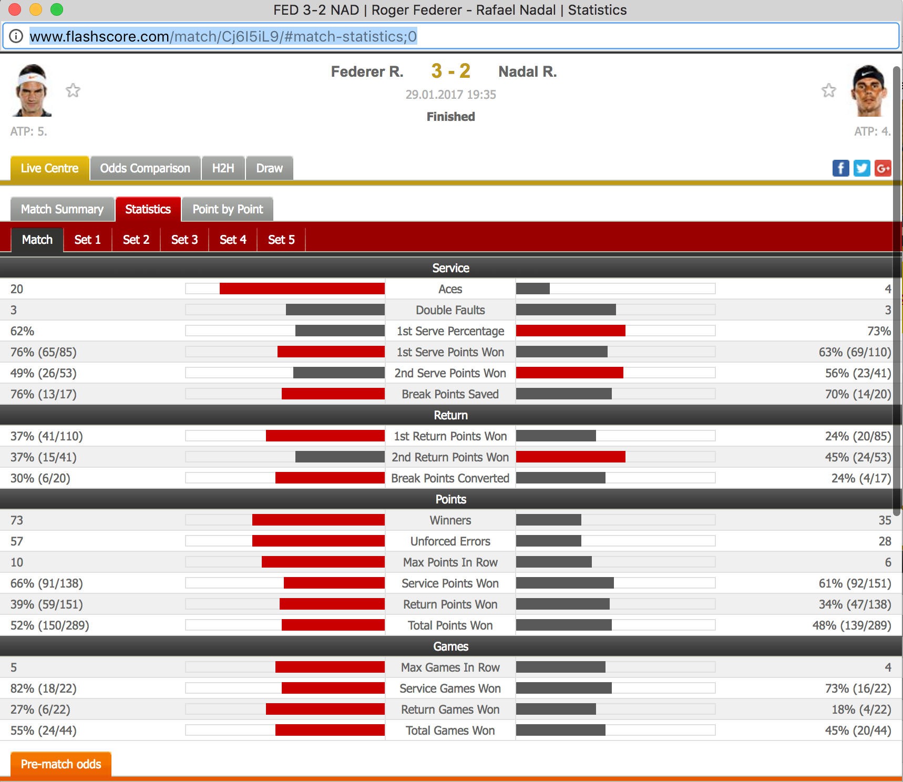
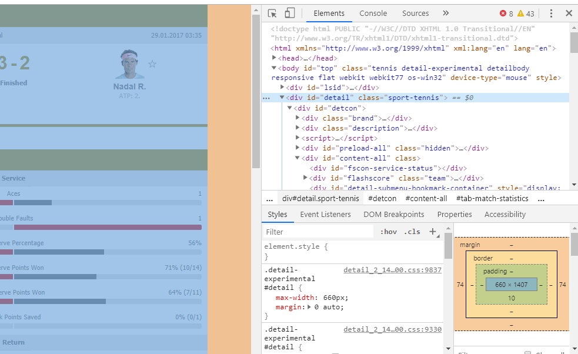
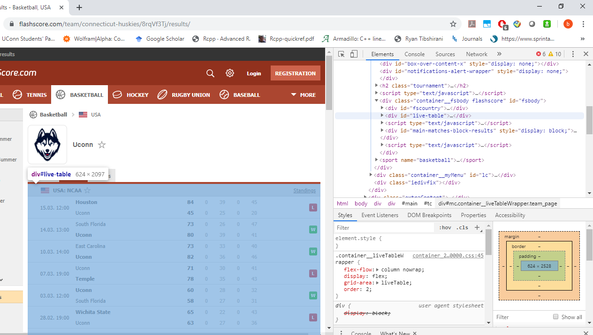
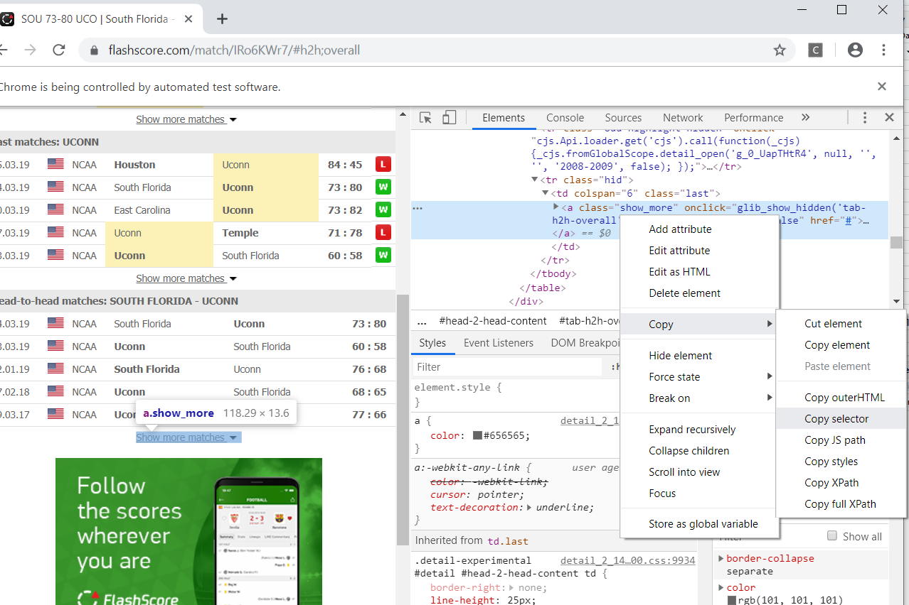
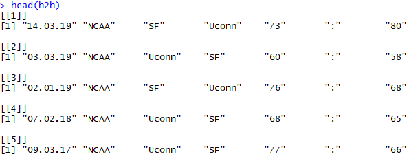
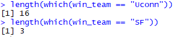

```{r setup, include=FALSE}
knitr::opts_chunk$set(echo = FALSE)
require("rvest")
require("RSelenium")
require("knitr")
require("kableExtra")
```

## Outline
- Material: "github.com/wanwanx/WebScraping_UCSAS"

- Why do we need to "scrape"?

- Types of web scraping

- Using R
  + import files stored online
  + static data
  + dynamic data

- Case study (college basketball - UConn)

- Summary


## Motivation
Have you experienced ...

- Have a topic in mind, but not sure where to find the data. 

- Found related data online, not able to download directly.

- Need a reproducible way to capture similar data repeatedly.

- Need more than just numbers, maybe also texts, images, or even GIFs.


## Different types of web scraping
[Example (College basketball school index)](https://www.sports-reference.com/cbb/schools/)

- Human Copy-Paste: Click, drag, ctrl+c, ctrl+v. 

    - *Slow and inefficient.*
       
- Text pattern matching: make use of [regular expression](https://regexr.com/). 

    - *Complicated, need specific software to implement.*
       
- API interface: [ScraperAPI](https://www.scraperapi.com/?fp_ref=krishna-32), [Octoparse](https://www.octoparse.com/?AgentCode=296), 

    - *Powerful but expensive, some pages may not be accessible.*  
        
- [DOM (Document Object Model)](https://en.wikipedia.org/wiki/Document_Object_Model) parsing:
      
    - *Not intuitive, require programming.*

## Getting started

- Prerequisites: experience with R, have a working RStudio/R with you.

      - we are only focusing on R today, other languages also work.

- Advantages of R: 

      - open source, it's FREE!
      
      - lightweight (compared with commerical software such as MATLAB, SAS) 
      
      - awesome package ecosystem (more than 12,000 packages available on CRAN now)


## Getting started 

- For this workshop, we'll utilize a few packages in R:

```{r pckgs, eval=FALSE, echo=TRUE}
install.packages("rvest", repos = "http://cran.us.r-project.org")
install.packages("RSelenium", repos = "http://cran.us.r-project.org")
```

- Use `help()` function to take a closer look.

```{r help, echo=TRUE, eval=FALSE}
# details on using the `help` function
?help                        
# information about the rvest package
help(package = "rvest")       
```

## Getting started

What are the possible scenarios we will be facing? 

- Some data files are available already. Import directly! 

- The web pages are simple ...
    
      - data is hidden in the source code (static data)

- The web pages are complicated ...

      - the numbers are not in the source code (dynamic data)


## Importing files stored online
- Files that can be read with `read.csv` or related functions can be directly imported from a URL.

- Example: we extract the most recent Australian Open Tennis Championships match [(AUS Open)](http://www.tennis-data.co.uk/ausopen.php):
```{r echo=TRUE, message=FALSE, warning=FALSE}
url <- "http://www.tennis-data.co.uk/2019/ausopen.csv"
tennis_aus <- read.csv(url)
```

```{r echo=FALSE, message=FALSE, warning=FALSE}
require("kableExtra")
kable(tennis_aus, "html",align=c(rep('c',times=ncol(tennis_aus)))) %>%
    kable_styling(font_size = 14) %>%
    scroll_box(width = "1000px", height = "200px")
```

## Importing files stored online

- We can use `download.file()` to download the file to your working directory and then work with this data as desired.
```{r eval=FALSE, echo=TRUE}
url <- "http://www.bls.gov/cex/pumd/data/comma/diary14.zip"

# download .zip file and unzip contents
download.file(url, dest = "dataset.zip", mode = "wb") 

# unzip on the downloaded path directly
unzip("dataset.zip")

# assess the files contained in the .zip file
list.files("diary14")
```

- Not neccessarily to save the zip file, [`tempfile()`](https://stackoverflow.com/questions/3053833/using-r-to-download-zipped-data-file-extract-and-import-data)


## Exercise: online file import

If we want the same data for the 2018 US Open, how do you think we could do that?

Step 1. Find out the URL.

hint: check out the previous 2019 AUS open URL:

"http://www.tennis-data.co.uk/2019/ausopen.csv"


Step 2. Apply the `read.csv()` function.

## Solution: online file import

Changing the year and tournament names in the URL are enough to get the correct file.

```{r echo=TRUE, message=FALSE, warning=FALSE}
url <- "http://www.tennis-data.co.uk/2018/usopen.csv"
tennis_us <- read.csv(url)
```

What about the format?
```{r echo=FALSE, message=FALSE, warning=FALSE}
require("kableExtra")
kable(tennis_us, "html",align=c(rep('c',times=ncol(tennis_aus)))) %>%
    kable_styling(font_size = 14) %>%
    scroll_box(width = "1000px", height = "200px")
```


## Static \& dynamic data

Unfortunately, most of the data are not available directly. 

In this case, you can still capture the data but you need to know whether it is `static` or `dynamic` via the source code. Web developer tools open the door to "view source". 


## Exercise: static or dynamic? 

- [Apple](https://www.apple.com/iphone-11/specs/)

- [Reddit](https://www.reddit.com/)

- [Tennis Elo rankings](http://tennisabstract.com/reports/atp_elo_ratings.html)

- [NCAA (UConn)](https://www.flashscore.com/team/connecticut-huskies/8rqVf3Tj/results/)

## Solution: static or dynamic? 

<div class="columns-2">
  {height=300px}
  
  Static:  Apple, Tennis Elo rankings
  
  
  {height=300px}
  
  Dynamic:  Reddit, NCAA (UConn)

## Scrape static data
- Directly read in the source code line by line. `readLines()` can achieve that.

```{r echo=TRUE, message=FALSE, warning=FALSE}
tennis_elo <- readLines("http://tennisabstract.com/reports/atp_elo_ratings.html")
head(tennis_elo)
```

- Restricted usage, need further cleaning.

## Scrape static data

- HTML elements are written with a start tag, an end tag, and with the content in between: `<tagname>content<tagname>`. The tags typically contain the textual content we wish to scrape, and we will be working with the following:

<div class="columns-2">
  <center>{width=250px}</center>

  - `<h1>`, `<h2>`: headings;
  - `<p>`: paragraph;
  - `<div>`: division or section;
  - `<table>`: table. `<tr>`, `<td>`, `<th>`
</div>
    

-  Inspect elements (just right click)


## Scrape static data

- More advanced methods: use scraping packages like `rvest` or `RCurl`. 

- `rvest`: Instead of going line by line, we search for specific tagnames(nodes). 
    
    - Developed by RStudio team, make use of the pipe operator [%>%](http://uc-r.github.io/pipe) developed through the `magrittr` package.
    
    - data %>% filter(variable == numeric_value)
    


## Example: Scrape static data - NBA box score
Example: NBA box scores in [June 13th](https://www.basketball-reference.com/boxscores/?month=6&day=13&year=2019).

```{r echo=TRUE, message=FALSE, warning=FALSE}
require('rvest')
url_nba <- "https://www.basketball-reference.com/boxscores/?month=6&day=13&year=2019"
webpage <- read_html(url_nba)
webpage %>% html_nodes(css = 'h1') %>% html_text()
```

How many tables do you think there are in the page?

How would R store them? 

     - vectors, matrices, arrays, data frames, lists ...


## Example: Scrape static data - NBA box score

```{r echo=TRUE, message=FALSE, warning=FALSE}
boxscore_0613 <- webpage %>%
                html_nodes(css = 'table') %>%
                html_table()
typeof(boxscore_0613)
```    


```{r echo=FALSE, message=FALSE, warning=FALSE}
kable(boxscore_0613, "html") %>%
    kable_styling(font_size = 13) %>%
    scroll_box(width = "1000px", height = "200px")
```


## Exercise: static data
- Try to scrape only the division standings table for the Eastern conference.

    + you can subset previous list, find the index of this table

    + another way is to directly scrape only this target table


- Can you further calculate the average win/loss percentenge in Atlantic division? 

    
## Solution: static data
```{r echo=TRUE, message=FALSE, warning=FALSE}
webpage <- read_html(url_nba)
boxscore_east <- webpage %>%
                html_nodes(xpath = '//*[@id="divs_standings_E"]') %>%
                html_table(header = T)
```       

```{r echo=FALSE, message=FALSE, warning=FALSE}
kable(boxscore_east[[1]], "html") %>%
    kable_styling(font_size = 12) %>%
    scroll_box(width = "1000px", height = "170px")
```

```{r echo=TRUE, message=FALSE, warning=FALSE}
boxscore_east <- boxscore_east[[1]]
mean(as.numeric(boxscore_east$`W/L%`[2:6]))
``` 

## Exercise: loop through static data

- How to extract all Toronto Raptor's score in every month's first day in season 2018/2019?

    - the regular season began on October 16, 2018 and ended on April 10, 2019

    - start with [November 1st 2018](https://www.basketball-reference.com/boxscores/?month=11&day=1&year=2018)

    - find pattern in the url: ...boxscores/?month=11&day=1&year=2018
    
    - implement R loop

- Can you extend this to the whole year of 2018?


## Solution: loop through static data

Step 1: construct the sequence of URLs.

```{r echo=TRUE, message=FALSE, warning=FALSE}
url_common_start <- "https://www.basketball-reference.com/boxscores/?month="
url_seq  <- paste0(c(11,12,1:4),"&day=1&year=",c(rep(2018,2),rep(2019,4)))
```


```{r echo=FALSE, message=FALSE, warning=FALSE}
url_seq_print <- data.frame(paste0(url_common_start,url_seq))
colnames(url_seq_print) = c("URL")
kable(url_seq_print, "html") %>%
    kable_styling(font_size = 15,position = "left") %>%
    scroll_box(width = "1000px", height = "200px")
```

## Solution: loop through static data

Step 2: implement the loop for URL sequence

```{r echo=TRUE, message=FALSE, warning=FALSE}
score_raptor_2018 <- NULL
for (i in 1:length(url_seq)){
  url <- paste0(url_common_start,url_seq[i])
  webpage <- read_html(url)
  boxscore <- webpage %>%
    html_nodes(xpath = '//*[@id="divs_standings_E"]') %>%
    html_table(header=T)
  boxscore <- boxscore[[1]]
  score_raptor_month <- boxscore[boxscore$`Eastern Conference` == "Toronto Raptors*",]
  score_raptor_2018 <- rbind(score_raptor_2018,score_raptor_month,make.row.names = FALSE)
}
```

```{r echo=FALSE, message=FALSE, warning=FALSE}
kable(score_raptor_2018, "html",align="cccccc") %>%
    kable_styling(font_size = 15,position = "left") %>%
    scroll_box(width = "1000px", height = "150px")
```


## Scrape dynamic data

- Because dynamic data is created on-the-fly (in response to user interactions) we have to browse to get access to it. 

- "browse": open Chrome, read content, find the keywords, click hyperlink, extract information.

- Can this process be automated?

- YES! We just need to find what instructions to give to mimic the browsing, and get familiar with tools that can implement these instructions.

## Set up `RSelenium`

- With packages `RSelenium`, an interface with software [Selenium](https://www.seleniumhq.org/), makes it easy to connect to a Selenium Server.

```{r eval=FALSE, message=FALSE, warning=FALSE, echo = TRUE}
install.packages("RSelenium", repos = "http://cran.us.r-project.org")
require(RSelenium)
```

- Connect to a server. Other methods include using [Docker](https://cran.r-project.org/web/packages/RSelenium/vignettes/basics.html#introduction) or [Java binary](https://cran.r-project.org/web/packages/RSelenium/vignettes/basics.html#introduction).
```{r eval=FALSE, message=FALSE, warning=FALSE, echo = TRUE}
## try default function
rD <- rsDriver(port = 4444L, browser = "chrome")
```    


## Set up `RSelenium`
Possible errors:


- check the version of your chrome driver (chromehelp -> about google chrome -> version), check the supported selenium driver, find the closest configuration in the package, change default value.

```{r echo=TRUE, message=FALSE, warning=FALSE}
binman::list_versions("chromedriver")
```

```{r eval=FALSE, message=FALSE, warning=FALSE, echo = TRUE}
rD <- rsDriver(port = 4444L, browser = "chrome", chromever = "77.0.3865.40")
```

## Set up `RSelenium`
Possible error:


- Try a different number as port, any positive number should work.
```{r eval=FALSE, message=FALSE, warning=FALSE, echo = TRUE}
rD <- rsDriver(port = 5679L, browser = "chrome", chromever = "77.0.3865.40")
remDr <- rD[["client"]]
remDr$navigate("http://www.google.com")
```

After this command, you should see a pop-up blank tab, let's move on!

## Scrape dynamic data
- Lots of functions are implemented and [documented](https://cran.r-project.org/web/packages/RSelenium/RSelenium.pdf), basic steps including:

    - Set the web driver, select browser and port (hopefully done!)
    
    - Find the elements with the data
    
    - Extract the contents
    
    - Parse the contents
    

## Example: dynamic data
Consider the following match summary: [2017 Australian Open Final](http://www.flashscore.com/match/Cj6I5iL9/#match-statistics;0)

<center>
{width=800px}
</center>


## Example: dynamic data

If we inspect the page, we find that these stats are dynamic data. We also find that the main table of content has the id `detail`.

<center>
{width=950px}
</center>


## Example: dynamic data
Following previous steps, after setting up the server, we extract the table of stats using the CSS `id` node.

```{r eval=FALSE, message=FALSE, warning=FALSE, echo = TRUE}
## navigate to the page first
url <- "http://www.flashscore.com/match/Cj6I5iL9/#match-statistics;0"
remDr$navigate(url)
# Get id element
webElem <- remDr$findElements(using = 'id', "detail")
#  Use getElementText to extract the text from this element
unlist(lapply(webElem, function(x){x$getElementText()}))[[1]]
remDr$close()
```


## Exercise: dynamic data
Take a look at another match [summary](https://www.flashscore.com/match/fNecEwW2/#match-statistics;0), can you extract the statistics in set 1, 2 and 3 seperately and compare to the full match result? 

- Set up driver for this URL;

- Find the key word you want to extract;

- Write a loop based on our example;

- Organize the result 

    - Hint: for a long string, `gsub()` and `strsplit()` can be useful.
    
## Solution: dynamic data
```{r eval=FALSE, message=FALSE, warning=FALSE, echo = TRUE}
# set up server
remDr <- rsDriver(port = 5558L, browser = "chrome", version = "4.0.0-alpha-2",
                  chromever = "77.0.3865.40")
remDr <- remDr[["client"]]
# start loop
url <- "https://www.flashscore.com/match/fNecEwW2/#match-statistics;"
result <- NULL
# start loop
for (i in 0:3){
  # navigate page
  remDr$navigate(paste0(url,i)) 
  # find elements
  webElem <- remDr$findElements(using = 'id', 'detail')
  #  Use getElementText to extract the text from this element
  result[i+1] <- unlist(lapply(webElem, function(x){x$getElementText()}))[[1]]
}
# close driver
remDr$close() 
```

## Solution: dynamic data
```{r eval=FALSE, message=FALSE, warning=FALSE, echo = TRUE}
result_set <- NULL
for (i in 1:4){
  res <- result[i]
  # grab and substitute. Remove irrelavant text before "set3"
  res <- gsub(".*Set 3\n(.+)", "\\1", res)
  # split string into vector
  result_set <- cbind(result_set, unlist(strsplit(res, split = '\n')))
}
colnames(result_set) <- c("match","set1", "set2","set3")
head(result_set)
```
{width=800px}

## What else ...

There are some other functions in the `RSelenium` package, including:

- `findElement()` with CSS selector or Xpath

- `sendKeysToElement()`, you can type in the query box (like Google), or press enter key using this command.

- `clickElement()`, mimic mouse event

- `getTitle()`,`getSource()`,`screenshot()`,`switchToFrame()`...

- [R openSCI document]("https://ropensci.github.io/RSelenium/articles/basics.html") provides a detailed example on Google homepage.


## Case study: College basketball - UConn
If we want to know how is UConn's performance at NCAA basketball 2018/2019, which kind of data may be helpful? 

- match record, win/loss

- score record, home/away

- Opponent information, head to head statistics

There are tons of websites/resources out there, I'll use [FlashScore](https://www.flashscore.com/) as an example today. 


## Case study: College basketball - UConn
Let's take a look at UConn's [homepage](https://www.flashscore.com/team/connecticut-huskies/8rqVf3Tj/results/):

<center>
{width:75%}
</center>

## Case study: College basketball - UConn
```{r eval=FALSE, message=FALSE, warning=FALSE, echo = TRUE}
url <- "https://www.flashscore.com/team/connecticut-huskies/8rqVf3Tj/results/"
remDr <- rsDriver(port = 5556L, browser = "chrome",version = "4.0.0-alpha-2",
               chromever = "77.0.3865.40")
remDr <- remDr[["client"]]
remDr$navigate(url) 
```

<center>
{width=900px}
</center>

## Case study: College basketball - UConn
```{r eval=FALSE, message=FALSE, warning=FALSE, echo = TRUE}
webElem <- remDr$findElements(using = 'id', "live-table")
unlist(lapply(webElem, function(x){x$getElementText()}))
```

<center>
{width=800px}
</center>

<center>

</center>

- It would be great if we can collect more information in one script.

- How to click the "show more matches"?

## Case study: College basketball - UConn
- To "click", we inspect the element (right click -> inspect -> right click highlight -> copy -> copy selector), then apply `findElements()`. 

```{r eval=FALSE, message=FALSE, warning=FALSE, echo = TRUE}
click_ind <- remDr$findElement(using = 'css selector', 
                              "#live-table > div > div > div > a")
click_ind$clickElement()
```

<center>


</center>

- Just like when we click using the mouse, there is no guarantee how many more rows we get to see. Loop condition became *do...until...*.

## Case study: College basketball - UConn

```{r eval=FALSE, message=FALSE, warning=FALSE, echo = TRUE}
url <- "https://www.flashscore.com/team/connecticut-huskies/8rqVf3Tj/results/"
remDr$navigate(url)
repeat{
  x <- try(click_ind <- remDr$findElement(using = 'css selector', 
                                          "#live-table > div > div > div > a"),
      silent=TRUE)
  if (inherits(x, "try-error")) break
  click_ind$clickElement()
}
```


## Case study: College basketball - UConn
- Now with all the available data, time to scrape and clean! 

```{r eval=FALSE, message=FALSE, warning=FALSE, echo = TRUE}
webElem <- remDr$findElements(using = 'id', "live-table")
uconn_score_all <- unlist(lapply(webElem, function(x){x$getElementText()}))
uconn_score <- unlist(strsplit(uconn_score_all, split = '\n'))[-c(1:3)]
```

Below is the first 50 elements of organized object uconn_score.
<center>

</center>


## Case study: College basketball - UConn
What about a single match prediction? 

- Just for a minute, pretend we are at March 13th, 2019. There will be a game between South Florida and UConn tomorrow. 

- To predict which team would win, we may need...

    + head to head statistics between the two teams
    
    + SFU winning rate, UConn winning rate etc.


## Case study: College basketball - UConn
For head to head comparison, inspect the element first again:
<center>
{width=900px}
</center>

## Case study: College basketball - UConn
Similar to the example, we first load all the data by "clicking" show more results.
```{r eval=FALSE, message=FALSE, warning=FALSE, echo = TRUE}
url <- "https://www.flashscore.com/match/IRo6KWr7/#h2h;overall"
remDr$navigate(url)
webElem <- remDr$findElement(using = 'css selector', 
                             "#tab-h2h-overall > div:nth-child(3) > 
                             table > tbody > tr.hid > td > a")
webElem$clickElement()
```

## Case study: College basketball - UConn
```{r eval=FALSE, message=FALSE, warning=FALSE, echo = TRUE}
webElem <- remDr$findElement(using = 'css selector', 
                             "#tab-h2h-overall > div:nth-child(3) > table")
## extract head to head table 
h2h <- unlist(webElem$getElementText())
## organize format
h2h <- unlist(strsplit(h2h, split = '\n'))[-c(1,17,20)]
h2h <- gsub("South Florida", "SF", h2h)
```



## Case study: College basketball - UConn
```{r eval=FALSE, message=FALSE, warning=FALSE, echo = TRUE}
## count the number of wins for both teams
win_team <- NULL
for (i in 1:length(h2h)){
  team <- h2h[[i]][c(3,4)]
  score <- as.numeric(h2h[[i]][c(5,7)])
  win_team <- c(win_team, team[which.max(score)])
}
```

{width=400px}

## Case study: College basketball - UConn
- Looks like UConn is gonna win! 

<center>

</center>

- It's cool, but be careful, may need more investigation! 

## Attention!

<center>
{width=700px}
</center>

- There are legal and ethical aspects to data scraping, check out this [article](https://www.datahen.com/legal-ethical-aspects-data-scraping/).

- Example: delayed quotes on [Cboe](http://www.cboe.com/delayedquote/quote-table).


## Summary
- Import directly: `read_csv`, `download.file`

- Static: `readLines`, `rvest`

- Dynamic: `RSelenium`, `findElements`, `clickElements`

- Useful R functions: loops, `strsplit`, `gsub`

<div class="columns-2">
  

  - **Programming only provides the tool, when to use it or what to use it on, still relies on analytical thinking.**
</div>


## Resources

- [CSS and HTML crash course](http://flukeout.github.io/)

- [rvest](https://www.r-bloggers.com/rvest-easy-web-scraping-with-r/)

- [RSelenium](https://ropensci.org/tutorials/rselenium_tutorial.html)

- [R task view: web technology](https://cran.r-project.org/web/views/WebTechnologies.html)


